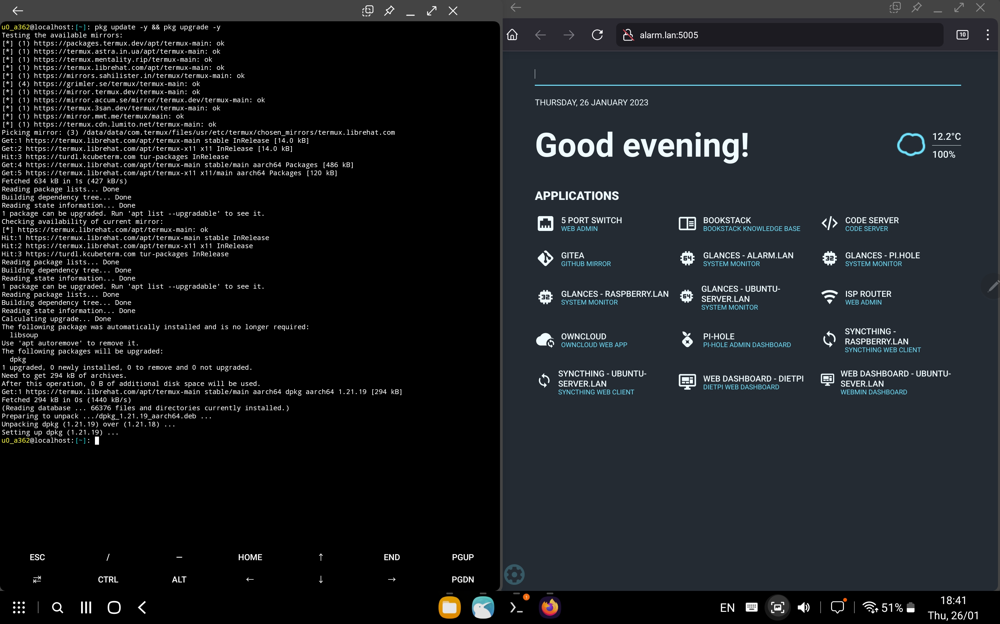
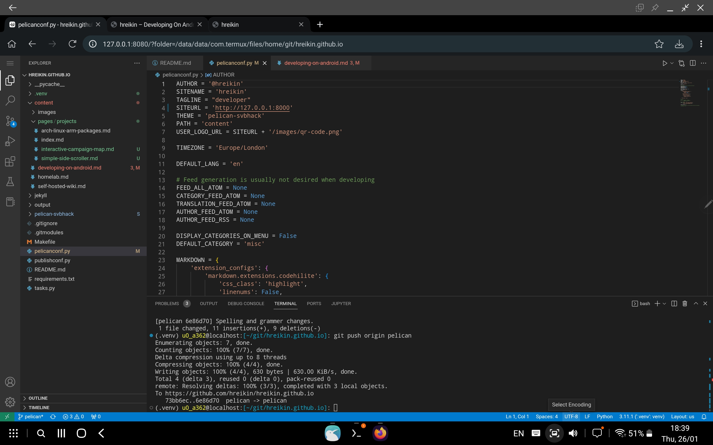

Title: Developing Software On Android Using Termux
Date: 2023-01-26 10:30
Category: mobile-dev
Tags: dev, mobile, termux,
Keywords: dev, development, linux, mobile, termux,
Author: @hreikin
Summary: My initial experiences trying web and software development on Android using Termux.
Lang: en
Series: Developing Software On Android Using Termux

*Using Android for software or web development hasn't always been an easy or stable experience in the past however in recent years it has come on leaps and bounds. This is the 1st post in my series on "Developing Software On Android Using Termux", I will cover the apps used and my initial thoughts and impressions.*

Previously I have used my phone to do things in a pinch when I have had no other option but recently I bought myself a tablet and wanted to see how feasible it would be to use it for software or web development and how far I could push it before running into any deal-breaking issues. I have never owned a tablet but the family has so as this was a rare treat for me I decided to choose a high-end one. The tablet in question is a Samsung S8 Ultra that comes with:

- 256 GB storage (expandable by microSD)
- 12 GB of RAM
- 8-core Snapdragon SM8450
- Adreno 730 GPU
- a 14.6-inch Super AMOLED screen
- an S-Pen
- USB-C display-out capability
- Dex Mode

It's the 2nd or 3rd best model they do with one being available with 16 GB of RAM but it was the best that was available that I could find for purchase and I am extremely happy with it. It cannot be considered cheap costing around £1000 but it is a high-end tablet with some great specifications.

## Termux

Termux is a terminal emulator and Linux environment application available on Android. It requires no rooting or setup. A small base system is installed automatically and additional packages are available via `apt` or `pkg`. It is available on [GitHub](https://github.com/termux/termux-app) or [F-Droid](https://f-droid.org/packages/com.termux/). Do not install the Google Play version as it hasn't been updated in a long time due to some external issues.

Termux allows you to set up a Linux development machine fairly easily, I have made a few Bash scripts (Github repository available [here](https://github.com/hreikin/termux-dev-setups) if you're interested.) to simplify it even further and won't go into detail about the process but once Termux is installed then after using one of my scripts I will have access to a variety of programs such as:

- Code Server and/or Code OSS
- Python
- Git
- Firefox
- XFCE desktop environment

[{: .image-process-article-image}](images/termux-firefox-splitscreen.jpg){: target="_blank"}

This is extremely useful as I'm sure you can tell, my installation script offers a minimal or desktop version with a few key differences. The minimal version comes with Code Server which allows you to run a locally available, open-source version of VS Code accessible from an Android or desktop browser. The desktop version is accessible via VNC or XserverSDL and comes with the desktop version of Firefox and Code OSS which is the open-source version of VS Code.

## Dex Mode

Dex mode is available on Samsung phones and tablets and is pretty much the reason I chose them over another manufacturer. It allows you to turn your device into a desktop and connect an external monitor via a cable or through casting. Other manufacturers offer similar modes but Dex has been around the longest and is probably the most mature. Dex isn't essential to being able to develop on Android but it increases usability when using a mouse and keyboard however development using just the S-Pen and normal Android keyboard without Dex works brilliantly in my experience.

[{: .image-process-article-image}](images/dex-home.jpg){: target="_blank"}

## Things I've Tried

As this is a new "challenge" I have set myself this list is quite small but I have had no problems so far getting anything working. This whole website has been made using Code Server and the Kiwi Browser app available on Android. The website is just a simple static one created using [Pelican](https://github.com/getpelican/pelican) which is a static site generator written in Python. Previously the website used [Jekyll](https://jekyllrb.com/) and getting that set up and converted to using Pelican wasn't harder or any different to how it would be done on a PC.

[{: .image-process-article-image}](images/code-server-in-kiwi-browser.jpg){: target="_blank"}

## Conclusion

I have also had success using Django, Tkinter and NodeJS. Web development seems to be a perfect candidate for using phones and tablets as development environments with even low-end devices being viable as an option. I plan to see how far I can push it regarding software development with the only issue I can foresee being any system requirements of 3rd-party libraries or dependencies not being able to be installed due to limitations with Android or because I currently haven't rooted the device.